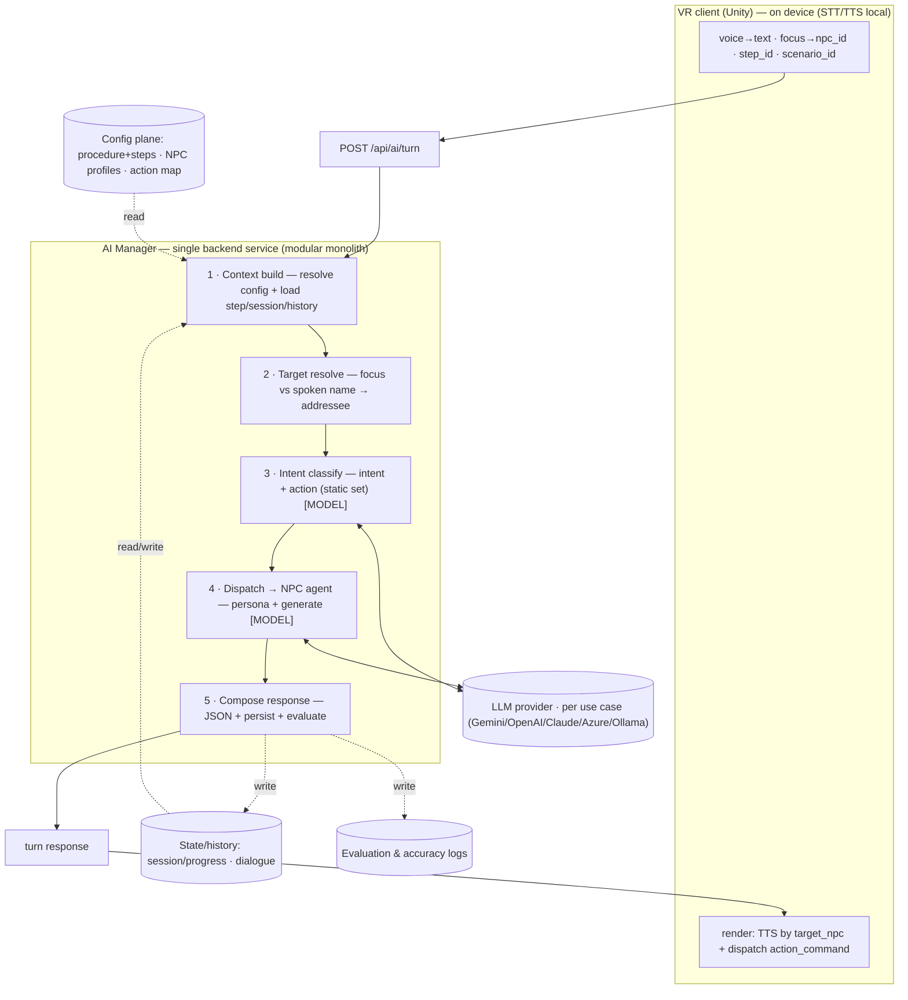
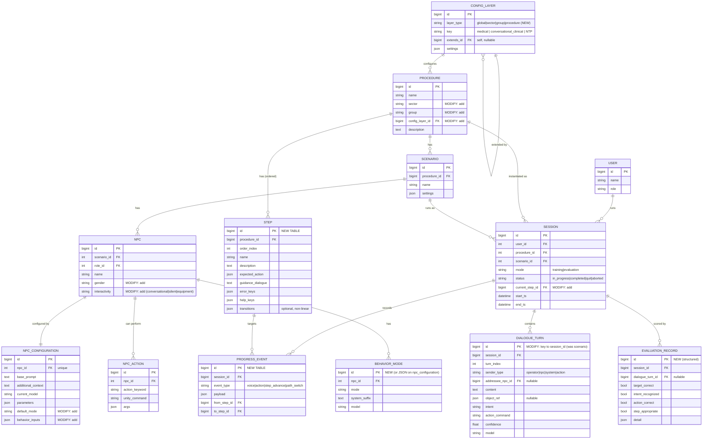

# Esculapio VR — AI Manager: Context & Decisions

> **Purpose.** This file is a context handoff for the Claude Code agent working on the Esculapio VR backend. It captures the AI Manager solution, the NPC and procedure configuration model, the VR client request/response contract, the proposed data models, the API endpoints, and the decisions behind them. A separate file covers the detailed software architecture and per-node workflows; this file is the "why and what," that file is the "how it flows."

---

## 0. Integration philosophy (read this first)

**We are adding the AI Manager as a clean new module, not rewriting the backend.** The existing Laravel backend stays largely as-is; the AI layer is integrated with **minimal, additive changes** to existing tables and controllers. When in doubt: reuse an existing table, add a column rather than a table, add a table rather than refactor a flow. Do not restructure working code to fit this document — align this document's model onto the working code.

Concretely:
- **Reuse as-is:** `procedures`, `scenarios`, `npc`, `npc_roles`, `npc_configurations`, `npc_actions`, `procedure_sessions`, `users`.
- **Add (only where genuinely needed):** a structured `steps` model, `config_layers`, `behavior_modes` (or JSON on `npc_configurations`), `progress_events`, and structured evaluation fields.
- **One correctness fix:** dialogue/message records must be keyed to the **session**, not only to the scenario (today `messages` are scenario-keyed), otherwise progress tracking and scoring have nothing to attach to.

---

## 1. Project snapshot

Esculapio VR (by IQTech) is an immersive medical-training platform. A Unity VR client runs simulated clinical procedures; trainees speak to and act on virtual NPCs (patient, nurse, …). The **AI team builds the AI Engine** that receives requests from the VR client and returns intelligent responses (dialogue, actions, evaluation).

The supervisor's implementation guide is already in progress: a teammate created the `app/Services/AI/` module structure and **Postman-tested a mock request flow** returning standardized JSON. This context file builds on that scaffold — it does not replace it.

---

## 2. The AI Manager solution

The AI Manager is a **single backend service — a modular monolith**. A turn is processed by a sequence of in-process stages (function calls, not network hops, to keep the real-time voice loop fast). Only two stages call a model. The pipeline shape and the request/response contract are **fixed**; per-procedure and per-sector variation is **configuration (data), not code**.



---

## 3. Alignment with the existing scaffold (supervisor's guide)

The guide's `app/Services/AI/` classes already correspond to our stages. **Build the pipeline inside these existing services** — this is the single most important alignment point:

| Our stage | Existing service (from the guide) | Notes |
|---|---|---|
| Orchestrator (handleRequest / processRequest) | `AIManager/AIManagerService.php` | Owns the turn; calls the stages in order. |
| 1 · Context build | `Context/ContextBuilderService.php` | Collect procedure, scenario, NPC, current step, mode. Extend to also resolve **config layers** and load **session/history**. |
| 2 · Target resolve | *(new — add here or as a small resolver)* | Not in the guide. Add target/NPC resolution (focus vs spoken name). |
| 3 · Intent classify | `Conversation/` + `Prompt/` | Guide folds intent into conversation; keep as a step or as a first structured call. |
| 4 · Dispatch → NPC agent | `Conversation/ConversationService.php` + `Prompt/PromptBuilderService.php` + `Providers/*` | Persona prompt + provider call. |
| 5 · Compose response | `Parser/ResponseParserService.php` | Convert to the standard JSON contract; then persist/evaluate. |
| Evaluation (cross-cutting) | `Evaluation/EvaluationService.php` | evaluateStep / calculateScore / feedback. |
| Model calls | `Providers/{Gemini,OpenAI,Claude,AzureOpenAI,Ollama}Provider.php` | **Provider-agnostic** — the Manager works with any provider without changing the workflow. Model is selected per use case via config. |

**Decision:** keep the guide's provider abstraction. Our earlier "model per use case" is implemented as provider/model selection in config, resolved and handed to the `Providers/*` layer. Do not hard-code a single provider.

---

## 4. The five stages (contracts)

| Stage | Inputs | Logic | Model? | Output | Reads / Writes |
|---|---|---|---|---|---|
| 1 Context build | turn envelope | validate; resolve config layers (global→sector→group→procedure); load current step + expected action; load recent history | No | ContextBundle | reads procedure/steps, session, dialogue |
| 2 Target resolve | text, focus, npcs_in_scene | priority ladder (below); compute object_ref + confidence | No (optional NLU for ambiguous implicit address) | addressee_npc_id, object_ref, confidence | reads NPC profiles (names/aliases) |
| 3 Intent classify | text, addressee, intent taxonomy, action set | classify into known intents; extract action (from static set) + entities; confidence gate | **Yes** (structured/enum) | intent, action, entities, confidence | — |
| 4 Dispatch → agent | ContextBundle, addressee profile, intent/action, history | select model; assemble persona prompt + grounding; generate; validate action vs action map | **Yes** (generation) | response_text, action_command, emotion | reads NPC profiles, action map |
| 5 Compose response | target + intent + generation + meta | assemble standard JSON; persist turn; write evaluation; advance session | No | turn response → VR | writes dialogue, evaluation, session |

**Target-resolution ladder (stage 2), first match wins:**
`spoken NPC name` → `action/role only one NPC can satisfy` → `deictic ("you/this/him") bound to focus` → `focus (gaze)` → `clarify`.
**A spoken name overrides gaze.** Keep **addressee** (who acts/replies) separate from **object_ref** (who the action is performed on, resolved via deixis→focus). Example: *"Claire, check his pulse"* → addressee = Claire (nurse, by name), object_ref = patient (via "his" → focus).

---

## 5. NPC & procedure configuration model

### Procedures
A procedure is an **ordered set of steps**, each step carrying an expected action, guidance dialogue, and error/help keys, terminating in "complete." This structure is identical across all current procedures — it is the generic backbone. Steps are **currently hardcoded in the Unity client**; they must move to a backend `steps` model so the AI Manager has full context and evaluation is possible.

### Procedure groups (open categories)
Procedures cluster into **groups** by shared interaction logic. Current proposed medical groups (a hypothesis, to validate with medical reviewers):
- **conversational_clinical** — conscious patient, dialogue + guided actions (NTP, catheter).
- **resuscitation** — unconscious/silent patient, action-driven, time-critical (AED training, AED contest).
- **equipment_prep** — nurse-led equipment sequences, safety checks (oxygen mask, NGT feeding).

**`sector` and `group` are open lookups, not a fixed list.** New categories — medical or non-medical (e.g. the military scene already partial in the repo) — are new values/rows, not schema changes. Do not hard-code "medical" or these three groups.

### NPC profiles & configurations — *this is the current active work item*
The current backend already has partial NPC configuration (`npc`, `npc_roles`, `npc_configurations`, `npc_actions`). Align it to the AI layer with **minimal additions**:

- On `npc`: add `gender`, and `interactivity` ∈ {`conversational`, `silent`, `equipment`} — this drives whether a turn even produces dialogue and who the default addressee is.
- On `npc_configurations` (already has `base_prompt`, `additional_context`, `current_model`, `parameters`): add `default_mode` and optionally `behavior_inputs` (JSON). Keep persona in `base_prompt`; keep provider/model in `current_model`/`parameters`.
- **Behavior modes** (calm/fear/panic; cooperative/emergency): treat as a **context input** the client/scenario provides, *not* an engine the AI Manager runs. If a mode needs its own prompt/model, store it in a small `behavior_modes` table (`mode`, `system_suffix`, `model`); otherwise a JSON field is enough. Behavior can be injected later — it is relevant to generation but not owned by the Manager.
- **Actions**: `npc_actions` (`action_keyword → unity_command`) is the **static action set** per NPC/procedure. The model is **constrained to select from this set** (structured output) and stage 4 validates against it — the model never invents commands.
- **Per-step guidance dialogue** lives on the `steps` model (keyed by step + role), matching the codebase's per-step nurse-dialogue pattern — not on the NPC profile.

---

## 6. VR client contract

- **STT and TTS run on-device** (Whisper `tiny.en` + Wit.ai for STT; Wit.ai for TTS). The backend is **text-in / text-out** — backend STT/TTS cost ≈ $0.
- **Focus detection is Unity-side.** The gaze ray resolves the focused NPC locally and the client sends `npc_id` (+ name). Showing an NPC's name on hover is a Unity registry lookup, **not** an AI call.
- The client sends **`step_id` + `scenario_id`** each turn so the backend can build full context. **Progression is client-reported for now** (Unity owns which step it's on); the backend reads it and maintains its own session state from it.
- **Action / event turns hit the AI Manager.** A physical action with no speech (much of AED) calls the API to update context and the DB, and — the **non-linear seam** — may later trigger a step or path switch. The turn contract therefore supports non-voice turns (`sender_type` ∈ {operator, npc, system, action}).
- On the response, the client **routes TTS by `target_npc`** and **dispatches `action_command`** into the simulation.
- **Migration:** the VR side currently calls a legacy flat endpoint (`/api/process`, `scenario_id` hardcoded). It must migrate to the rich turn endpoint (§8). This is a VR-side integration task, tracked separately.

---

## 7. Proposed data models

Additive to the existing schema. Tags: **(exists)** reuse, **(modify)** small change, **(new)** add.



**New vs existing summary:** genuinely new = `CONFIG_LAYER`, `STEP`, `BEHAVIOR_MODE`, `PROGRESS_EVENT`, structured `EVALUATION_RECORD`. Small modifications = the added columns above + keying dialogue to `session_id`. Everything else is reused.

---

## 8. API endpoints

### Target endpoint (general case)
`POST /api/ai/turn` — one rich, stable contract for every procedure and sector.

**Request (VR → AI Manager):**
```jsonc
{
  "session_id": "uuid",
  "procedure_id": "NTP",
  "scenario_id": 1,
  "step_id": "measure_tube",
  "mode": "training",                         // training | evaluation
  "turn_kind": "voice",                       // voice | action | system
  "user_input": { "text": "Claire, please give me the scissors.", "lang": "en" },
  "focus": { "npc_id": 12, "npc_name": "Claire", "confidence": 0.92 },
  "npcs_in_scene": [
    { "npc_id": 11, "name": "John",   "role": "patient" },
    { "npc_id": 12, "name": "Claire", "role": "nurse"   }
  ],
  "context": { "patient_status": "calm", "env_flags": {}, "elapsed_sec": 134 }
}
```

**Response (AI Manager → VR):** `standard_turn_response` — the **fixed output shape**, identical for all procedures so the VR client parses one format:
```jsonc
{
  "target_npc":     { "npc_id": 12, "name": "Claire", "role": "nurse" },
  "response_text":  "Sure, here are the scissors.",
  "action_command": "hand_over:scissors",     // maps to npc_actions.unity_command
  "intent":         { "name": "request_action", "confidence": 0.88 },
  "object_ref":     { "npc_id": 11 },          // action's object, nullable
  "evaluation":     { "target_correct": true, "intent_recognized": true,
                      "action_correct": true, "step_appropriate": true },
  "emotion":        "calm",                     // optional hint for Unity
  "meta":           { "model": "...", "provider": "...", "latency_ms": 420 }
}
```

### Reconciliation with the tested mock
The teammate's Postman-tested mock is the **evaluation slice** of the same idea:
```jsonc
// mock:  POST /api/ai/request
{ "procedure_id": 1, "student_action": "Picked Syringe", "npc_id": 2 }
// →
{ "correct": true, "score": 95, "feedback": "Excellent. Continue to the next step." }
```
This maps into the full contract as an **action turn** (`turn_kind: "action"`, `user_input` empty, `student_action` → a `PROGRESS_EVENT` payload) whose response is the `evaluation` block plus a `feedback` string. **Decision to confirm:** unify on one endpoint (recommended: `POST /api/ai/turn`) with the mock treated as the evaluation-only case, versus keeping `/api/ai/request` for evaluation and adding `/api/ai/turn` for dialogue. Recommendation: **one endpoint, one contract**, because it keeps the VR parser and the pipeline single. Keep the mock flow working as the evaluation path while the contract is generalized.

### Config layering (the "generic schema", field-level)
`CONFIG_LAYER.settings` resolves global → sector → group → procedure, later overriding earlier:
```jsonc
// global.default
{ "context_schema": { "required": ["procedure_id","scenario_id","step_id","mode","focus","npcs_in_scene","user_input"] },
  "target_resolution": { "priority": ["spoken_name","action_capability","deixis_to_focus","focus","clarify"], "min_confidence": 0.6 },
  "response_schema": "standard_turn_response",
  "evaluation": { "signals": ["target_correct","intent_recognized","action_correct","step_appropriate"] } }
// medical.default  (extends global)
{ "npc_model": { "roles": ["patient","nurse","doctor"] },
  "generation": { "grounding": ["step_context","patient_state"], "language": "auto_detect" } }
// medical.conversational_clinical  (extends medical)
{ "npc_model": { "default_addressee": "patient", "patient_interactivity": "conversational" },
  "intents": ["request_action","request_information","clinical_check","social","help"],
  "evaluation": { "format": "continuous" } }
// medical.resuscitation  → silent patient, default_addressee "nurse",
//   intents ["action_confirm","urgency","help"], evaluation.format "pass_fail_timed"
// medical.equipment_prep → default_addressee "nurse",
//   intents ["equipment_action","environmental_check","help"], evaluation.format "continuous_safety"
```
`standard_turn_response` is a **named reference** to the fixed response shape above — declared once in the global layer and inherited by all, so the output contract stays stable across every procedure/sector.

---

## 9. Key decisions (quick reference)

1. AI Manager = single modular-monolith service; stages are in-process modules; only Intent + Dispatch call a model.
2. Generic core + layered config; procedures are **data**, new sectors/groups are additive config; `sector`/`group` are **open**.
3. Target resolution ladder; **spoken name overrides gaze**; addressee and object_ref are separate.
4. Focus detection is **Unity-side**; passed in as `npc_id`; not an AI call.
5. STT/TTS **on-device**; backend is text-in/text-out.
6. Steps: **client-reported `step_id`+`scenario_id`** now, but backend must own a **structured step model**.
7. **Action/event turns hit the AI Manager** (context + DB + non-linear seam via `PROGRESS_EVENT`).
8. Behavior modes are a **context input** (can be injected later), not a Manager-owned engine.
9. Actions are **static** per NPC/procedure; model is **constrained** to the action set and **validated** against it.
10. **Provider-agnostic** LLM layer (guide's `Providers/*`); model per use case via config.
11. **Stable output contract** (`standard_turn_response`) across all procedures.
12. **Minimal-change integration**: new `Services/AI` module reuses existing structure; additive tables only; dialogue keyed to `session_id`.
13. Linear-first; the non-linear "Director" (path switching) is **deferred** but seamed in (`STEP.transitions`, `PROGRESS_EVENT.path_switch`).
14. **Security:** rotate the OpenAI key committed in the backend `README.md` before wider rollout.

---

## 10. Open decisions to confirm

- **Endpoint unification** — `/api/ai/turn` single contract vs. keep `/api/ai/request` for evaluation (recommend unify).
- **Scenario layer** — keep `SCENARIO` between procedure and NPC (codebase has it), or fold into procedure. Affects NPC/Session foreign keys.
- **Evaluation granularity** — `EVALUATION_RECORD` per-turn, per-session, or both.
- **Behavior modes** — separate `behavior_modes` table vs. JSON on `npc_configurations` (depends on whether modes need distinct models/prompts).
- **Step-advancement ownership** — confirmed client-reported for now; revisit when the non-linear Director is designed.

---

## 11. Deferred / out of scope (for now)

- Non-linear scenario orchestration ("Director") — designed as a seam, not built.
- Aggregate scoring / feedback reporting beyond per-turn evaluation signals.
- Multilingual specifics beyond `lang` detect + provider routing.
- Config authoring/admin UI (existing content-authoring flows remain).

---

## 12. Immediate next step (active)

**Align NPC profiles & configurations with the AI layer** (current work item). The backend has partial NPC config already; the task is to (a) confirm what exists vs. the target shape in §5/§7, (b) add the minimal fields (`interactivity`, `gender`, `default_mode`, behavior modes, ensure the static action set is complete), and (c) make the profile fully readable by `ContextBuilderService` and `ConversationService` so stage 4 can assemble persona + grounding. Keep changes additive and aligned with the workflows above.
